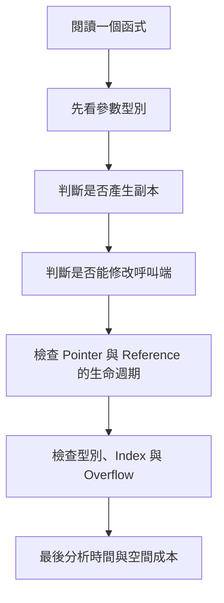
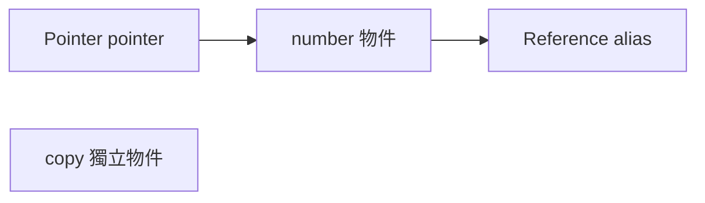
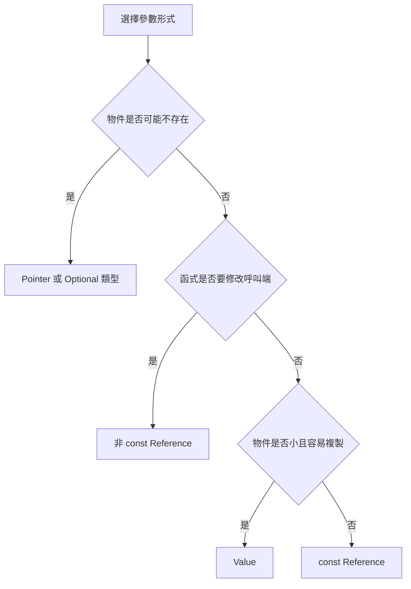

## 附錄 G　C++ 演算法基礎

### 適用範圍

本附錄整理閱讀與撰寫 C++ 演算法程式時會反覆使用的語言觀念。目標不是完整介紹 C++，而是回答下列實作問題：

- 函式收到的是副本，還是原物件的別名？
- 函式是否可以修改呼叫端資料？
- Pointer、Reference 與 Object 的生命週期有什麼關係？
- `std::vector` 為什麼有時會讓 Iterator、Pointer 與 Reference 失效？
- `int`、`long long`、`size_t` 混用時，為什麼結果可能和預期不同？
- Recursive DFS 使用的 Stack，和 `std::stack` 是否為同一個東西？
- 演算法的空間複雜度應如何計入容器、動態配置與 Call Stack？

很多錯誤不是演算法方向不正確，而是函式介面、資料 Ownership、型別或生命週期沒有先整理清楚。本附錄會使用小型程式逐步說明，並建立一套閱讀 C++ 演算法程式的固定流程。



### 適用讀者

- 能看懂基本 C++ 語法，但不熟悉 Value、Reference、Pointer 差異的讀者。
- 常因為函式沒有修改到原資料，或意外修改原資料而困惑的讀者。
- 使用 TreeNode、ListNode、Iterator 或 Smart Pointer 時，容易混淆 Ownership 的讀者。
- 常遇到 `size_t`、signed、unsigned、Overflow 與反向迴圈問題的讀者。
- 想從函式宣告判斷複製成本與副作用的讀者。

### 快速導覽

- [G.1 先從一段函式宣告看起](#g1-先從一段函式宣告看起)
- [G.2 Value、Reference 與 Pointer](#g2-valuereference-與-pointer)
- [G.3 Call by Value](#g3-call-by-value)
- [G.4 Call by Reference](#g4-call-by-reference)
- [G.5 const Reference](#g5-const-reference)
- [G.6 Pointer Parameter](#g6-pointer-parameter)
- [G.7 Pointer 本身與 Pointer 指向的物件](#g7-pointer-本身與-pointer-指向的物件)
- [G.8 參數傳遞如何選擇](#g8-參數傳遞如何選擇)
- [G.9 Object Lifetime](#g9-object-lifetime)
- [G.10 Stack Memory、Dynamic Storage 與 Call Stack](#g10-stack-memorydynamic-storage-與-call-stack)
- [G.11 Stack Container 與 Call Stack](#g11-stack-container-與-call-stack)
- [G.12 RAII 與 Smart Pointer](#g12-raii-與-smart-pointer)
- [G.13 常見 STL 傳遞方式](#g13-常見-stl-傳遞方式)
- [G.14 Iterator、Pointer 與 Reference 失效](#g14-iteratorpointer-與-reference-失效)
- [G.15 int、long long 與 Integer Overflow](#g15-intlong-long-與-integer-overflow)
- [G.16 size_t、signed 與 unsigned](#g16-size_tsigned-與-unsigned)
- [G.17 Integer Promotion 與運算順序](#g17-integer-promotion-與運算順序)
- [G.18 常見 C++ 演算法介面模式](#g18-常見-c-演算法介面模式)
- [G.19 常見問題與判讀](#g19-常見問題與判讀)
- [G.20 程式閱讀檢查表](#g20-程式閱讀檢查表)
- [G.21 本附錄重點](#g21-本附錄重點)

### G.1 先從一段函式宣告看起

看到函式時，不要先跳進函式內容。先看參數與回傳型別：

```cpp
long long rangeSum(
    const std::vector<int>& values,
    int left,
    int right);
```

這段宣告已經提供很多資訊：

<table>
<tr><th>部分</th><th>可以讀出的資訊</th></tr>
<tr><td>`long long`</td><td>答案可能超過 int 可保存範圍</td></tr>
<tr><td>`const std::vector<int>&`</td><td>不複製整個 vector，而且函式承諾不修改它</td></tr>
<tr><td>`int left`</td><td>left 以 Value 傳入，函式內修改 left 不影響呼叫端</td></tr>
<tr><td>`int right`</td><td>right 同樣是獨立副本</td></tr>
</table>

接著才檢查：

- 區間是 `[left, right]` 還是 `[left, right)`？
- 空區間如何表示？
- left 與 right 是否可能越界？
- 加總前是否需要轉成 `long long`？

函式宣告是程式規格的一部分，不只是語法外殼。

### G.2 Value、Reference 與 Pointer

先用一個整數觀察三者：

```cpp
int number = 10;
int copy = number;
int& alias = number;
int* pointer = &number;
```

此時：

- `copy` 是獨立整數，初始值從 number 複製而來。
- `alias` 是 number 的別名。
- `pointer` 保存 number 的位址。

```cpp
copy = 20;      // number 仍是 10
alias = 30;     // number 變成 30
*pointer = 40;  // number 變成 40
```



Reference 與 Pointer 都能間接接觸原物件，但語意不同：

<table>
<tr><th>項目</th><th>Reference</th><th>Pointer</th></tr>
<tr><td>是否可為空</td><td>正常使用下不可</td><td>可以是 `nullptr`</td></tr>
<tr><td>是否可重新指向</td><td>綁定後不能改綁其他物件</td><td>可以改存其他位址</td></tr>
<tr><td>使用方式</td><td>像一般物件</td><td>需解參考或使用 `->`</td></tr>
<tr><td>常見語意</td><td>必須存在的別名</td><td>可選物件、節點連結、位址關係</td></tr>
</table>

### G.3 Call by Value

Call by Value 會讓函式參數成為獨立物件。

```cpp
void increment(int value)
{
    ++value;
}

int main()
{
    int number = 5;
    increment(number);
    // number 仍是 5
}
```

#### vector 以 Value 傳入

```cpp
void sortCopy(std::vector<int> values)
{
    std::sort(values.begin(), values.end());
}
```

這會建立一份 vector 副本。排序只影響副本，呼叫端不變。

這不一定是錯誤。若函式本來就要產生修改後的副本，可以利用 Value 語意：

```cpp
std::vector<int> sortedCopy(std::vector<int> values)
{
    std::sort(values.begin(), values.end());
    return values;
}
```

呼叫：

```cpp
std::vector<int> sorted = sortedCopy(original);
```

如果傳入 lvalue `original`，通常需要複製。如果傳入可移動的暫時物件，編譯器與標準函式庫可能使用 Move，降低複製成本。

#### 何時適合 Value

- `int`、`char`、`bool`、Enum 等小型型別。
- 小型且容易複製的 Struct。
- 函式需要一份獨立副本。
- 函式預計取得 Ownership 或修改本地副本。

### G.4 Call by Reference

非 const Reference 可修改呼叫端物件。

```cpp
void normalize(std::vector<int>& values)
{
    for (int& value : values)
    {
        if (value < 0)
        {
            value = 0;
        }
    }
}
```

這裡有兩層 Reference：

- `values` 是呼叫端 vector 的 Reference。
- `int& value` 是 vector 中每個元素的 Reference。

如果 Range-based for 寫成：

```cpp
for (int value : values)
```

`value` 是每個元素的副本，修改它不會改到 vector。

#### Reference 作為輸出參數

```cpp
bool findMinimum(
    const std::vector<int>& values,
    int& result)
{
    if (values.empty())
    {
        return false;
    }

    result = *std::min_element(values.begin(), values.end());
    return true;
}
```

這種介面用 bool 表示是否找到答案，再透過 `result` 輸出。若專案可使用 `std::optional<int>`，通常能讓「可能沒有答案」更直接。

### G.5 const Reference

`const T&` 表示：

- 不複製整個物件。
- 函式不能透過這個 Reference 修改物件。

```cpp
long long sum(const std::vector<int>& values)
{
    long long answer = 0;

    for (int value : values)
    {
        answer += value;
    }

    return answer;
}
```

這是唯讀大型容器常見的參數形式。

#### const 不代表原物件永遠不會改

`const Reference` 只表示「不能透過這個介面修改」。如果其他地方仍持有非 const Reference 或 Pointer，原物件可能被其他路徑修改。

#### 不要回傳區域物件的 const Reference

```cpp
const std::string& badName()
{
    std::string name = "David";
    return name; // 錯誤：函式返回後 name 已失效
}
```

`const` 不會延長已命名區域物件的生命週期。

### G.6 Pointer Parameter

Pointer 適合表示：

- 參數可能不存在。
- Tree 或 Linked List 的節點連結。
- 需要直接處理位址。
- 與既有 C 介面互動。

```cpp
int treeHeight(const TreeNode* node)
{
    if (node == nullptr)
    {
        return 0;
    }

    return 1 + std::max(
        treeHeight(node->left),
        treeHeight(node->right));
}
```

`const TreeNode*` 表示不能透過 node 修改 TreeNode。Pointer 本身仍是區域副本，可以在函式內重新指向其他節點。

#### `T* const` 與 `const T*`

```cpp
const TreeNode* node;
```

Pointer 可改指向，但不能透過它修改 Node。

```cpp
TreeNode* const node = root;
```

Pointer 不能改指向，但可透過它修改 Node。

```cpp
const TreeNode* const node = root;
```

Pointer 不能改指向，也不能透過它修改 Node。

讀型別時可以從變數名稱往外看，並搭配實際修改權限驗證。

### G.7 Pointer 本身與 Pointer 指向的物件

以下函式不會改變呼叫端 Pointer 的指向：

```cpp
void moveToNext(ListNode* node)
{
    if (node != nullptr)
    {
        node = node->next;
    }
}
```

因為 node 本身以 Value 傳入，是一份位址副本。

但它可以修改指向的物件：

```cpp
void clearValue(ListNode* node)
{
    if (node != nullptr)
    {
        node->value = 0;
    }
}
```

若要修改呼叫端 Pointer，可以使用 Pointer Reference：

```cpp
void moveToNext(ListNode*& node)
{
    if (node != nullptr)
    {
        node = node->next;
    }
}
```

需要先區分：

```text
修改 Pointer 變數本身
修改 Pointer 指向的物件
```

這兩件事不同。

### G.8 參數傳遞如何選擇



這是一般起點，不是不可改變的規則。還要考慮：

- 函式是否要取得 Ownership。
- 是否要保存參數到函式外。
- 是否接受 Temporary Object。
- API 是否需要表達 null。
- 複製或 Move 成本。

### G.9 Object Lifetime

Pointer 與 Reference 本身不保證物件仍存在。

#### 回傳區域變數位址

```cpp
int* badPointer()
{
    int value = 10;
    return &value;
}
```

函式返回後，value 的生命週期結束，回傳 Pointer 變成 Dangling Pointer。

#### 保存 vector 元素位址後再 push_back

```cpp
std::vector<int> values{1, 2, 3};
int* first = &values[0];
values.push_back(4);
```

若 push_back 觸發重新配置，`first` 可能失效。

#### Reference 捕捉與 Lambda

若 Lambda 保存區域變數的 Reference，Lambda 被帶到區域外使用時，要確認被捕捉物件仍存在。

演算法題雖少見長生命週期 Callback，但理解此規則有助於避免隱性 Dangling Reference。

### G.10 Stack Memory、Dynamic Storage 與 Call Stack

「Stack」在 C++ 學習中常指不同概念：

- 區域變數常具有 Automatic Storage Duration。
- 函式呼叫使用 Call Stack。
- `std::stack` 是容器介面。

動態配置的物件通常具有 Dynamic Storage Duration：

```cpp
TreeNode* node = new TreeNode();
delete node;
```

直接使用 `new`、`delete` 容易產生漏釋放、重複釋放與例外安全問題。在具有 Ownership 的一般 C++ 程式中，應優先考慮 RAII 與 Smart Pointer。

#### Recursive Algorithm 的空間

```cpp
int factorial(int n)
{
    if (n == 0)
    {
        return 1;
    }

    return n * factorial(n - 1);
}
```

最大遞迴深度為 O(n)，因此額外空間也要列入 O(n)，即使沒有建立任何 STL 容器。

### G.11 Stack Container 與 Call Stack

`std::stack<int>` 是由程式明確控制的容器：

```cpp
std::stack<int> pending;
pending.push(0);
int node = pending.top();
pending.pop();
```

Call Stack 由函式呼叫機制維護。Recursive DFS 使用 Call Stack 保存返回位置，Iterative DFS 使用 `std::stack` 保存待處理 Node。

兩者都呈現 LIFO，但來源、生命週期與可控制程度不同。

### G.12 RAII 與 Smart Pointer

RAII 的核心是讓資源釋放綁定物件生命週期。

#### unique_ptr

```cpp
std::unique_ptr<TreeNode> root =
    std::make_unique<TreeNode>();
```

`unique_ptr` 表示單一 Ownership，不可複製，但可 Move。

```cpp
std::unique_ptr<TreeNode> another = std::move(root);
```

Move 後，root 通常變成空 Pointer，Ownership 轉移到 another。

#### shared_ptr

`shared_ptr` 使用共享計數。最後一個 Owner 離開時釋放物件。

它不是一般 Raw Pointer 的直接替代品，因為有計數成本，而且互相引用可能形成 Ownership Cycle。

#### weak_ptr

`weak_ptr` 觀察 `shared_ptr` 管理的物件，但不增加 Ownership Count，可協助打破共享 Cycle。

#### 演算法平台的 Node

線上題庫常由平台建立與釋放 TreeNode、ListNode。此時 Raw Pointer 常只是遵循平台介面，不代表解題函式擁有 Node，也不應任意 delete。

### G.13 常見 STL 傳遞方式

#### vector

唯讀：

```cpp
void analyze(const std::vector<int>& values);
```

原地修改：

```cpp
void sortInPlace(std::vector<int>& values);
```

取得副本後修改：

```cpp
std::vector<int> sortedCopy(std::vector<int> values);
```

#### string

與 vector 類似。Substring 可能產生新字串與複製成本，需依實作方式分析。

#### unordered_map 與 unordered_set

唯讀查詢可用 const Reference；要更新則用非 const Reference。`operator[]` 在 Key 不存在時會插入預設值：

```cpp
int count = frequency[key];
```

這可能改變 Map。若只想查詢，可使用 `find()` 或 `contains()`。

#### pair 與 struct

小型 pair 可 Value 傳遞。大型 Struct 或含大型容器的 Struct，唯讀時通常用 const Reference。

#### Range-based for

```cpp
for (const auto& edge : graph[node])
```

避免複製 Edge 物件，且不修改元素。

```cpp
for (auto& edge : graph[node])
```

可修改元素。

```cpp
for (auto edge : graph[node])
```

每輪建立副本。

### G.14 Iterator、Pointer 與 Reference 失效

容器修改後，先前取得的位置資訊可能失效。

#### vector

- 重新配置後，所有元素 Pointer、Reference、Iterator 可能失效。
- `erase` 後，被刪位置及後方位置通常失效。
- `reserve()` 可降低重新配置次數，但仍需遵守失效規則。

#### unordered_map / unordered_set

Rehash 會使 Iterator 失效。對元素的 Pointer 與 Reference 是否失效，需依標準容器保證與具體操作判斷，不應憑直覺推測。

#### erase 迴圈

安全模式之一：

```cpp
for (auto it = values.begin(); it != values.end(); )
{
    if (*it < 0)
    {
        it = values.erase(it);
    }
    else
    {
        ++it;
    }
}
```

`erase` 回傳下一個有效 Iterator。

### G.15 int、long long 與 Integer Overflow

#### 指定給 long long 不代表運算使用 long long

```cpp
int width = 100000;
int height = 100000;
long long area = width * height;
```

右側先以 int 相乘，可能在指定前已溢位。

正確方向：

```cpp
long long area = 1LL * width * height;
```

#### 常見需要 long long 的位置

- Prefix Sum。
- Path Cost。
- Pair Count。
- 面積與乘積。
- 大型 DP 計數。
- Inversion Count。

#### INF 加法

```cpp
const long long INF = std::numeric_limits<long long>::max() / 4;
```

使用較小安全上限能降低 `INF + cost` 溢位風險，但仍應先略過不可達 State：

```cpp
if (distance[node] == INF)
{
    continue;
}
```

### G.16 size_t、signed 與 unsigned

`container.size()` 回傳 `size_type`，通常是 unsigned。

錯誤反向迴圈：

```cpp
for (std::size_t i = values.size() - 1; i >= 0; --i)
{
}
```

`i >= 0` 對 unsigned 永遠成立。減到 0 後會 underflow 成很大的值。

#### 可讀性較高的 signed 寫法

```cpp
for (int i = static_cast<int>(values.size()) - 1;
     i >= 0;
     --i)
{
}
```

前提是 values.size() 能安全轉成 int。演算法題通常規模可控，但正式程式仍應驗證。

#### 純 unsigned 反向模式

```cpp
for (std::size_t i = values.size(); i-- > 0; )
{
    // 使用 values[i]
}
```

語法較不直覺，應搭配註解與團隊慣例。

#### 混合比較

```cpp
int index = -1;
if (index < values.size())
{
}
```

比較時 index 可能轉成 unsigned，導致結果與直覺不同。應先確認 index 非負，再轉型或統一型別。

### G.17 Integer Promotion 與運算順序

`char`、`short` 等較小整數型別做運算時，常先提升為 int。

位移也要注意左側型別：

```cpp
1 << 40
```

如果 int 只有 32-bit，這不是想要的 64-bit Mask。應使用：

```cpp
1LL << 40
```

Operator Precedence 也可能造成誤讀：

```cpp
if (mask & (1 << i))
```

建議使用括號，明確表達先建立 Bit Mask，再做 AND。

### G.18 常見 C++ 演算法介面模式

#### 唯讀輸入，回傳答案

```cpp
long long solve(const std::vector<int>& values);
```

#### 原地修改

```cpp
void sortValues(std::vector<int>& values);
```

#### 可能沒有答案

```cpp
std::optional<int> findValue(
    const std::vector<int>& values);
```

#### 回傳多項結果

```cpp
struct SearchResult
{
    bool found;
    int index;
    int comparisons;
};
```

#### Tree / List 節點

```cpp
int height(const TreeNode* root);
ListNode* reverseList(ListNode* head);
```

第二個函式回傳新的 Head，因為反轉後原本 Head 不再是 List 開頭。

### G.19 常見問題與判讀

<table>
<tr><th>現象</th><th>可能原因</th><th>第一輪檢查</th></tr>
<tr><td>函式沒有修改原資料</td><td>參數以 Value 傳入</td><td>確認是否需要非 const Reference</td></tr>
<tr><td>函式意外修改原資料</td><td>使用非 const Reference 或 Pointer</td><td>改成 const Reference 或副本</td></tr>
<tr><td>Pointer 偶爾失效</td><td>物件生命週期結束或 vector 重新配置</td><td>追蹤 Ownership 與容器修改</td></tr>
<tr><td>大資料答案變負數</td><td>Integer Overflow</td><td>檢查中間運算型別</td></tr>
<tr><td>反向迴圈無法停止</td><td>使用 unsigned Index</td><td>檢查 size_t underflow</td></tr>
<tr><td>讀 Map 竟新增 Key</td><td>使用 `operator[]`</td><td>唯讀查詢改用 find 或 contains</td></tr>
<tr><td>遞迴大輸入崩潰</td><td>Call Stack 過深</td><td>估算最大深度或改 Iterative</td></tr>
<tr><td>Range-based for 修改無效</td><td>元素以 Value 取得</td><td>需要修改時使用 `auto&`</td></tr>
</table>

### G.20 程式閱讀檢查表

- 參數是 Value、Reference、const Reference 還是 Pointer？
- 哪些參數可能被修改？
- 是否存在大型容器複製？
- 回傳值是否表達「可能沒有答案」？
- Pointer 是否可能為 null？
- Pointer 或 Reference 指向的物件能活多久？
- 容器修改是否造成 Iterator、Pointer 或 Reference 失效？
- Range-based for 是副本、唯讀 Reference 還是可修改 Reference？
- `operator[]` 是否會意外插入 Map？
- signed 與 unsigned 是否混合比較？
- 中間乘法、加法與位移使用什麼型別？
- 遞迴的最大 Call Stack 深度是多少？
- Smart Pointer 表達的是哪一種 Ownership？
- 空間複雜度是否包含副本、容器與 Call Stack？

### G.21 本附錄重點

- Value 會建立獨立參數；Reference 與 Pointer 可以接觸原物件。
- 非 const Reference 適合明確的原地修改；const Reference 適合唯讀大型物件。
- Pointer 可以為 null，也能改指向，因此要額外檢查有效性與生命週期。
- 修改 Pointer 本身與修改 Pointer 指向的物件是兩件不同的事。
- Raw Pointer 不會自動表示 Ownership。
- RAII 與 Smart Pointer 用型別表達資源生命週期與 Ownership。
- `std::stack` 與 Call Stack 都是 LIFO，但不是同一個結構。
- vector 重新配置可能讓既有 Iterator、Pointer 與 Reference 失效。
- 指定給 `long long` 前，中間 int 運算可能已經 Overflow。
- `size_t` 是 unsigned，反向迴圈與負數比較要特別處理。
- 閱讀演算法程式時，先看函式介面、修改權限與生命週期，再進入迴圈與演算法細節。
